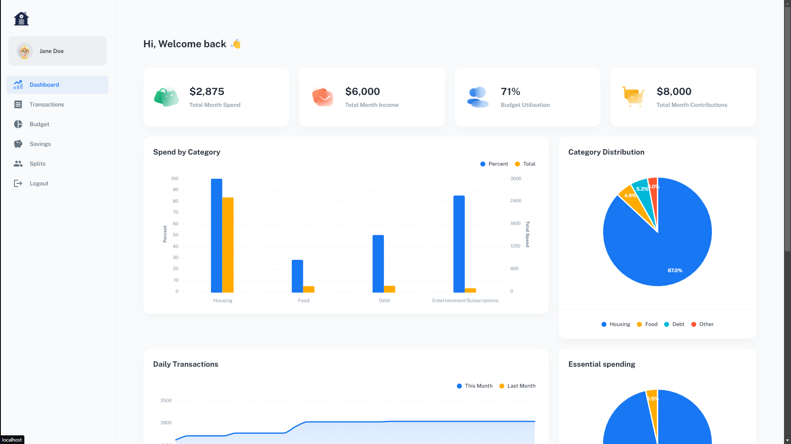

# Home Budgeting Application

This web application was designed to be run locally as a home server for managing budgets with multi user multi budget support. 

## Setup instructions
Refer to the respective READMEs in the `/frontend` and `/backend` directories. 

## Technical overview
### Backend
Technologies used:
- Flask REST API
- Database: sqlite + Flask SQL Alchemy
- Authentication: JWT

### Frontend
The frontend of the application is built using React.js. It was originally a fork of this repository: [material-kit-react](https://github.com/minimal-ui-kit/material-kit-react). 

## Demo
### Dashboard

### Transactions
Users can:
- Create new transactions
- Create bulk transactions by uploading a credit card statement
- Update existing transactions
- Delete transactions
- Split transactions with other users
- Filter by Category, User, Essential vs. non-essential spending, Expense vs. Income
- Search for transactions
- Sort by each column

### Budgets
On the budget tab users are able to see and manage their spending by category. 

### Savings
Users can monitor their savings and create new contributions. 

### Splits
Users can manage balancing shared expenses. The balance owing will show what the net balance is to the other user and allow the user to pay off anything owed. 

### Other supported user flows
1. Login
2. Forgot Password